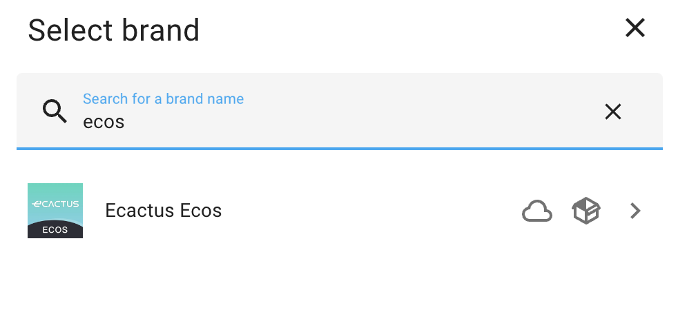
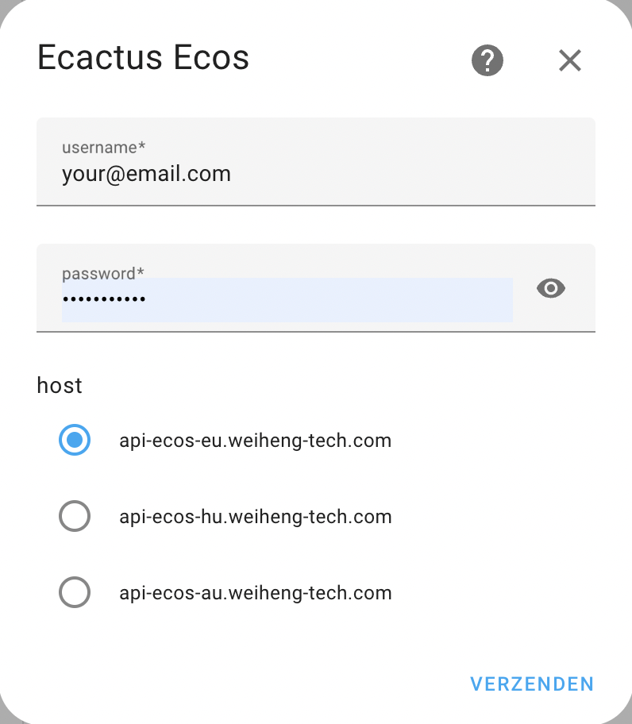
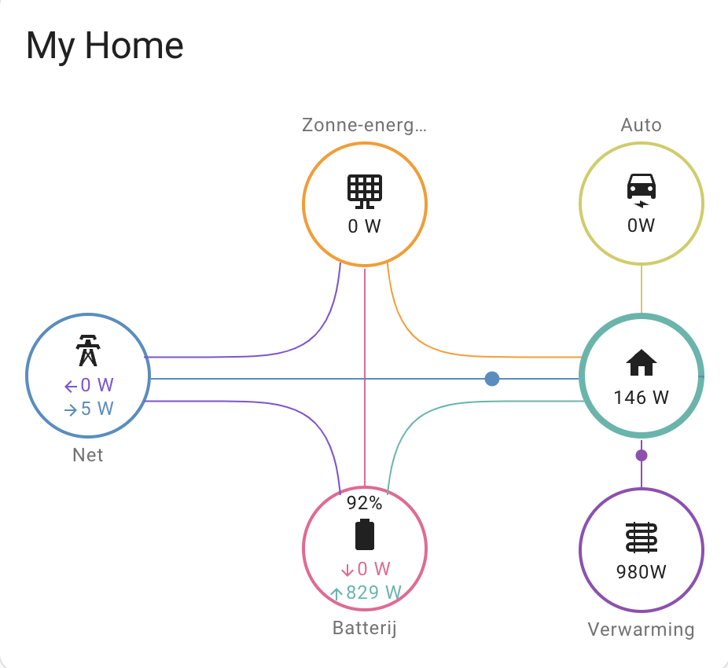

# eCactus-ecos-cloud for HomeAssistant

This integration alows you to connect to the webservices of your **eCactus ecos** intverter and battery and read the status and the different power states.

We use [ecactus-ecos-client](https://github.com/sjhoeksma/ecactus-ecos-client) python package to connect to the webservices

# Adding the service

**USE AT OWN RISK**:
The package is still under development so for now copy this directory to the **custom_components** of your homeassistant directroy. Now restart homeassistant and you should be able to add under integrations.

# Configure

Click on add integration and search for **ecactus ecos**


After you selected you can use your ecos login. Ensure your datacenter is selected correctly.


After a valid login sensors will be avaiable under **sensor.ecacatus\_**. If you system contains more then one batterypack, each battery will be available under the name of the battery.

# lovelace setup



```
type: custom:power-flow-card-plus
entities:
  grid:
    entity:
      production: sensor.tibber_pulse_thuis_power_production
      consumption: sensor.tibber_pulse_thuis_power
    secondary_info: {}
  solar:
    icon: mdi:solar-panel-large
    entity: sensor.ecactusecos_solar_power
    secondary_info: {}
  battery:
    icon: mdi:battery
    entity: sensor.ecactusecos_battery_power
    show_state_of_charge: true
    use_metadata: false
    invert_state: true
    state_of_charge: sensor.ecactusecos_battery_soc
    state_of_charge_unit_white_space: false
  home:
    entity: sensor.ecactusecos_grid_power
    secondary_info: {}
    circle_animation: true
    subtract_individual: true
    override_state: false
    use_metadata: true
  individual:
    - entity: sensor.wallbox_pulsarplus_sn_347021_laadvermogen
      color_icon: false
      display_zero: true
      name: Auto
      icon: mdi:car-electric
    - entity: sensor.warmtepomp_vermogen
      color_icon: false
      display_zero: true
      name: Verwarming
      icon: mdi:heating-coil
w_decimals: 0
kw_decimals: 2
min_flow_rate: 0.9
max_flow_rate: 6
watt_threshold: 10000
clickable_entities: true
title: My Home
```
