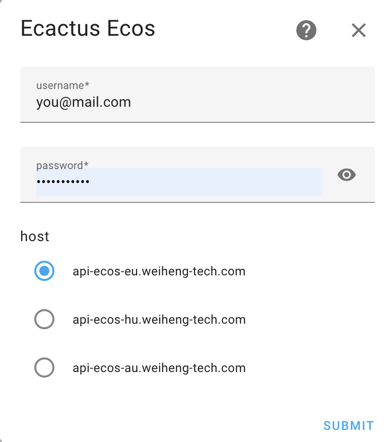

# eCactus-ecos-cloud for HomeAssistant

This integration alows you to connect to the webservices of your **eCactus ecos** intverter and battery and read the status and the different power states.

We use [ecactus-ecos-client](https://github.com/sjhoeksma/ecactus-ecos-client) python package to connect to the webservices

# Adding the service

**USE AT OWN RISK**:
The package is still under development so for now copy this directory to the **custom_components** of your homeassistant directroy. Now restart homeassistant and you should be able to add under integrations.

# Configure

Click on add integration and search for **ecactus ecos**

After you selected you can use your ecos login. Ensure your datacenter is selected correctly.

After a valid login sensors will be avaiable under **sensor.ecacatus\_**. If you system contains more then one batterypack, each battery will be available under the name of the battery.
